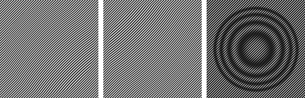
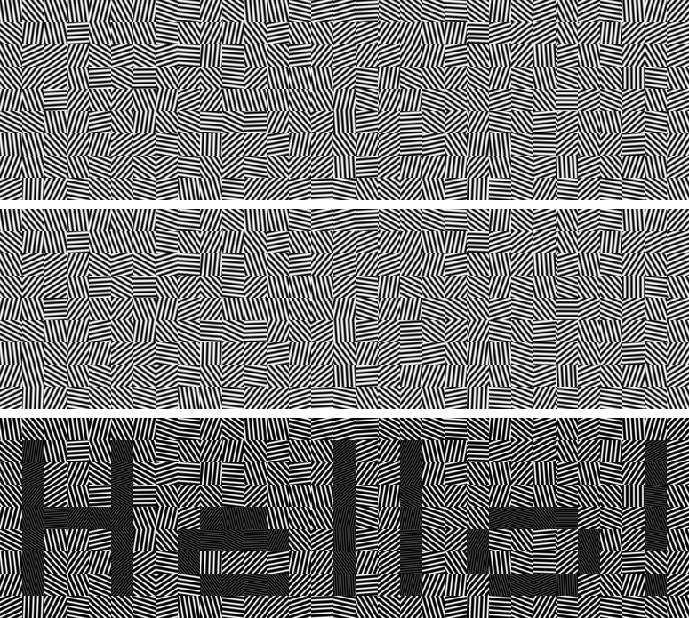

Moiré experiments
=================

This repo is used for experiments about `moiré effect <https://en.wikipedia.org/wiki/Moir%C3%A9_pattern>`_. It will be a collection of test scripts, not a fancy finished software.

interactive.qml
---------------

This is a simple shader/qml script (Qt5 library) to display computed images in
interactive way. It is totally independant of other scripts.

In fact, it is just a tool to merge two images on the fly by multiplicating
their pixels values, so that we do not have to open them in image editing tool
and apply filters on it.

Launch with *qmlscene interactive.qml*

It assumes gratings are saved as /tmp/i1.png and /tmp/i2.png (note: other
scripts do not save such images).

* Left drag to move image (Ctrl to constrain X, Shift to constrain Y, Alt to
  rotate)
* Right drag to rotate image
* Double left click to reset position
* Double right click to reset rotation

1_simple_initial
----------------

First tentative with naive code

Two linear gratings with different frequency create a 3rd linear frequency

2_round
-------

Not expected but interesting result

Two almost linear gratings create circular pattern

3_cross_circle
--------------

Circular grating with a cross emerging pattern

Result of try and errors with equations

4_spiral
--------

Circular gratings with spiral emerging pattern

Result of try and errors with equations

.. image:: results/4.png

5_pseudoinv
-----------

Use maths to 'invert' phase and have approximative rendered pattern computed

Need work to have better results

6_pseudoinv_color
-----------------

Generate two gratings that overlaps into a colored image

7_pixel_grid
------------

Generate two gratings that form a (binary) pixel grid

